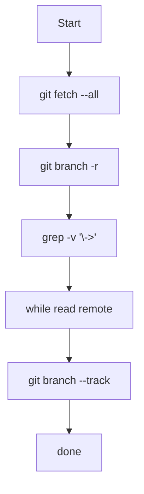

# Git Helper Scripts 📜

Welcome to the Git Helper Scripts! This folder contains a collection of bash scripts used to execute git commands and perform
advanced operations to automate your tasks. Below you will find a detailed description of each script, how to use them,
and a table of contents for easy navigation.

## Table of Contents
- [track-all-remotes.sh 🔧](#track-all-remotes-sh-)
  - [Usage 🛠️](#usage-)
  - [Script Content 📜](#script-content-)
  - [Diagrams 🖼️](#diagrams-)

## Scripts

### track-all-remotes.sh 🔧

This script tracks all remote branches locally.

- The script can be found here: [track-all-remotes.sh](./track-all-remotes.sh)

#### Usage 🛠️

To run the `track-all-remotes.sh` script, use the following commands in your bash terminal:

```bash
chmod +x track-all-remotes.sh && ./track-all-remotes.sh
```

After running the script, verify the branches were created by typing:

```bash
git branch -a
```

#### Script Content 📜

```bash
#!/bin/bash
git fetch --all
git branch -r | grep -v '\\->' | while read remote; do
    git branch --track "${remote#origin/}" "$remote"
done
```

#### Diagrams 🖼️


